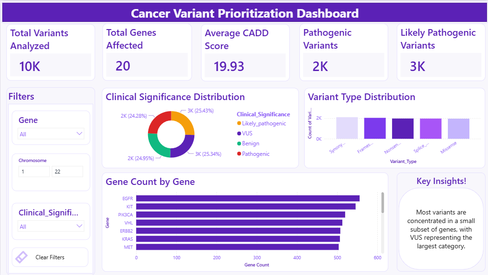
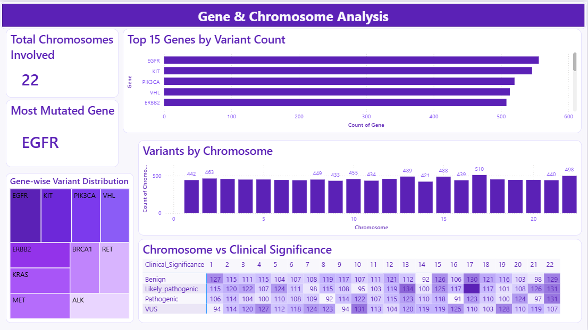
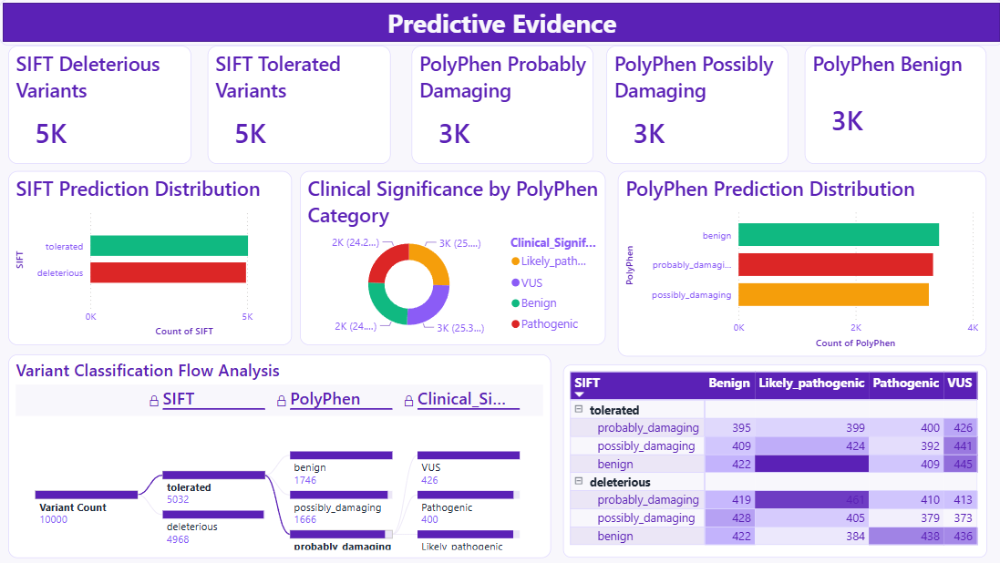
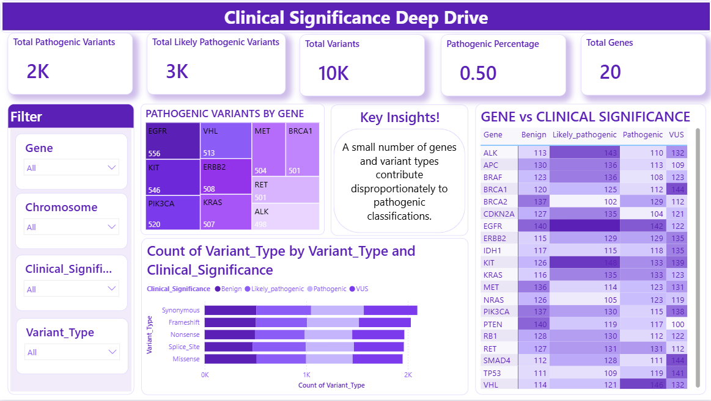

# 🧬 Cancer Variant Prioritization Dashboard

## 📖 Project Overview

The Cancer Variant Prioritization Dashboard is an interactive Power BI analytics solution designed to explore, evaluate, and prioritize genetic variants associated with cancer research and clinical interpretation.

Using genomic variant data, the dashboard transforms complex genetic information into meaningful visual insights that support researchers, clinicians, and analysts in understanding variant distribution, pathogenicity, clinical significance, and predictive evidence.

This project demonstrates the application of Business Intelligence and Data Visualization techniques in the field of Genomics and Healthcare Analytics.

---

## 🎯 Project Objectives

* Analyze genetic variant data across genes and chromosomes.
* Evaluate variant pathogenicity and clinical significance.
* Identify high-risk variants using predictive evidence metrics.
* Visualize genomic patterns through interactive dashboards.
* Support data-driven decision-making in cancer variant research.

---

## 📊 Dataset Description

The dataset contains **10,000 genomic variant records** with information related to chromosome location, gene association, variant type, population frequency, pathogenicity prediction scores, and clinical significance.

### Key Attributes

| Attribute             | Description                            |
| --------------------- | -------------------------------------- |
| Chromosome            | Chromosomal location of the variant    |
| Position              | Genomic position of the variant        |
| Gene                  | Associated gene name                   |
| Variant_Type          | Type of genetic variant                |
| Population_AF         | Population allele frequency            |
| CADD_Score            | Pathogenicity prediction score         |
| SIFT                  | Functional impact prediction           |
| PolyPhen              | Protein impact prediction              |
| Clinical_Significance | Clinical classification of the variant |

---

## 🛠 Tools & Technologies

* Microsoft Power BI
* Power Query
* DAX
* Microsoft Excel / CSV Dataset
* Data Modeling
* Interactive Data Visualization

---

## 📈 Dashboard Suite

### 1️⃣ Executive Overview Dashboard

Provides a high-level summary of the entire dataset through key performance indicators and executive metrics.

#### Key Features

* Total Variants
* Total Genes Analyzed
* Variant Type Distribution
* Clinical Significance Summary
* Population Frequency Overview
* Interactive Filtering

---

### 2️⃣ Variant Risk Assessment Dashboard

Focused on identifying potentially high-risk variants using predictive scoring metrics.

#### Key Features

* CADD Score Analysis
* SIFT Classification
* PolyPhen Assessment
* High-Risk Variant Identification
* Variant Prioritization Insights

---

### 3️⃣ Gene & Chromosome Analysis Dashboard

Analyzes variant distribution across genes and chromosomes.

#### Key Features

* Gene-wise Variant Counts
* Chromosome Distribution
* Top Mutated Genes
* Variant Density Analysis
* Comparative Genomic Insights

---

### 4️⃣ Predictive Evidence Dashboard

Provides analytical insights using computational prediction metrics.

#### Key Features

* Pathogenicity Prediction Trends
* CADD Score Distribution
* SIFT vs PolyPhen Comparison
* Predictive Confidence Evaluation
* Variant Impact Assessment

---

### 5️⃣ Clinical Significance Deep Dive Dashboard

Explores clinical classifications and their distribution.

#### Key Features

* Clinical Significance Categories
* Pathogenic vs Benign Analysis
* Variant Classification Trends
* Clinical Interpretation Support
* Risk Categorization

---

### 6️⃣ Research & Discovery Dashboard

Supports exploratory analysis and advanced research-oriented investigations.

#### Key Features

* Interactive Research Exploration
* Gene Discovery Analysis
* Emerging Variant Patterns
* Advanced Filtering
* Comparative Research Insights

---

## 📸 Dashboard Previews

### Executive Overview Dashboard

### Variant Risk Assessment Dashboard

### Gene & Chromosome Analysis Dashboard

### Predictive Evidence Dashboard

### Clinical Significance Deep Dive Dashboard

### Research & Discovery Dashboard

## 🔍 Key Insights Generated

* Distribution of variants across chromosomes and genes.
* Identification of variants with elevated pathogenicity scores.
* Comparative analysis of SIFT and PolyPhen predictions.
* Clinical significance trends across variant categories.
* Discovery of high-priority variants for further investigation.
* Exploration of genomic patterns supporting cancer research.

## 💡 Skills Demonstrated

* Data Cleaning & Transformation
* Power Query Development
* DAX Calculations
* Data Modeling
* Healthcare Analytics
* Genomic Data Visualization
* Business Intelligence
* Dashboard Design
* Analytical Reporting

## 🚀 Project Outcome

The Cancer Variant Prioritization Dashboard successfully converts large-scale genomic variant data into interactive analytical reports, enabling efficient exploration of genetic information and supporting research-driven decision-making in cancer genomics.

This project demonstrates the integration of healthcare data analytics, business intelligence, and advanced visualization techniques using Microsoft Power BI.
