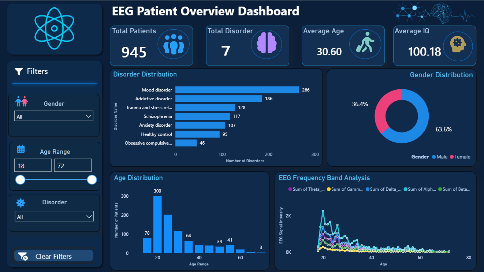
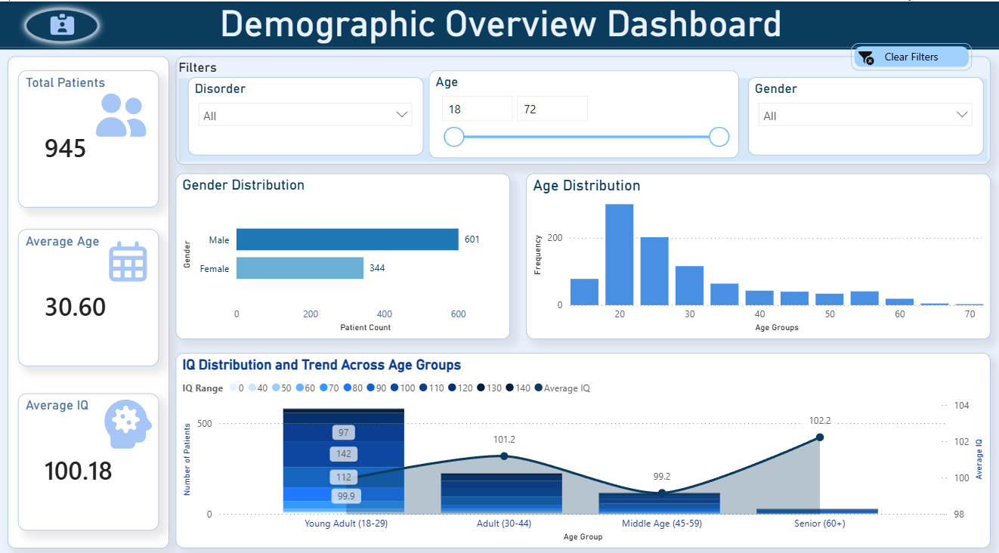
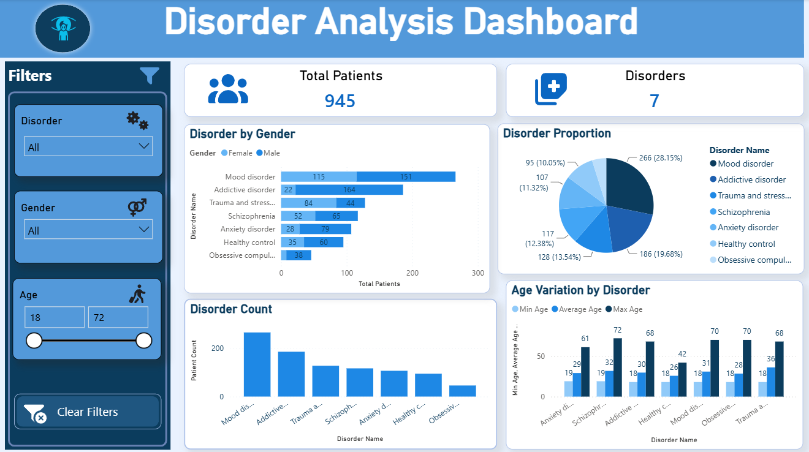
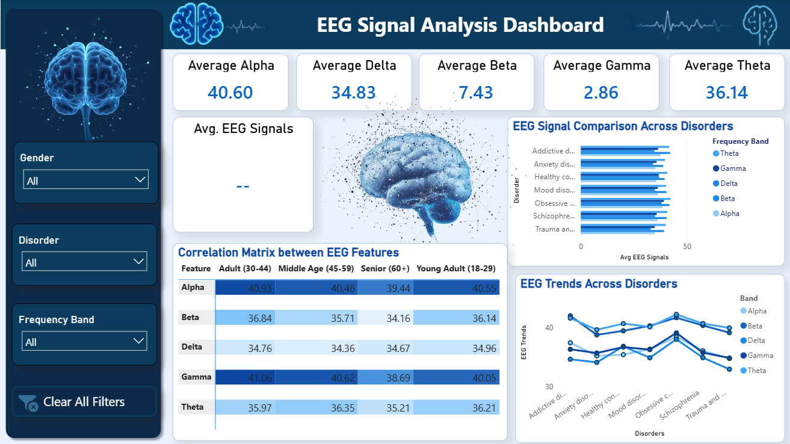

# EEG Analysis Dashboard

## Overview

This project presents an interactive Power BI dashboard developed for EEG (Electroencephalography) data analysis. The dashboard transforms complex EEG measurements into intuitive visualizations, enabling easier exploration of brainwave patterns and related analytical insights.

## Project Objectives

* Analyze EEG signal datasets.
* Visualize trends and patterns in EEG measurements.
* Present data through interactive dashboards.
* Support data-driven interpretation using Power BI.

## Tools & Technologies

* Microsoft Power BI
* Power Query
* DAX
* Microsoft Excel / CSV Data Sources

## Dashboard Features

* Interactive filtering
* Dynamic visualizations
* KPI monitoring
* Comparative analysis
* Trend exploration

## Skills Demonstrated

* Data Cleaning
* Data Transformation
* Data Visualization
* Dashboard Development
* Analytical Reporting
* Healthcare Data Analytics
* Business Intelligence

## Dashboard Preview

### EEG Patient Overview

### Demographic Overview

### Disorder-Analysis View

### EEG-Analysis View

## Project Files

* EEG_Analysis_Dashboard.pbix
* Dashboard Screenshots
* Project Documentation

## Learning Outcome

This project demonstrates the application of Power BI in healthcare-related data analysis and highlights the ability to convert raw EEG data into meaningful visual insights.
